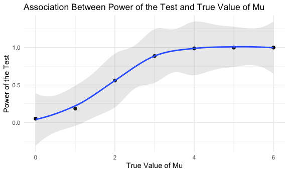
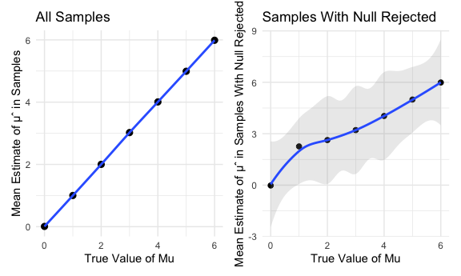

p8105_hw5_jl6321.Rmd
================

## Problem 2

``` r
homicide = read_csv("data/homicide-data.csv")
```

    ## Rows: 52179 Columns: 12
    ## ── Column specification ────────────────────────────────────────────────────────
    ## Delimiter: ","
    ## chr (9): uid, victim_last, victim_first, victim_race, victim_age, victim_sex...
    ## dbl (3): reported_date, lat, lon
    ## 
    ## ℹ Use `spec()` to retrieve the full column specification for this data.
    ## ℹ Specify the column types or set `show_col_types = FALSE` to quiet this message.

The raw data contains 52179 rows and 12 columns, including variables
uid, reported_date, victim_last, victim_first, victim_race, victim_age,
victim_sex, city, state, lat, lon, disposition.

Create a city_state variable and summarize within cities to obtain the
total number of homicides and the number of unsolved homicides:

``` r
homicide = 
  homicide %>% 
  mutate(
      city_state = str_c(city, state, sep = ", "),
      if_solved = case_when(disposition == "Closed without arrest" ~ "unsolved", 
                           disposition == "Open/No arrest" ~ "unsolved", 
                           disposition == "Closed by arrest" ~ "solved"))

num_homicide = 
  homicide %>% 
  group_by(city_state) %>% 
  summarize(
    total_homicide = n(), 
    unsolved_homicide = sum(if_solved == "unsolved")) 
num_homicide
```

    ## # A tibble: 51 × 3
    ##    city_state      total_homicide unsolved_homicide
    ##    <chr>                    <int>             <int>
    ##  1 Albuquerque, NM            378               146
    ##  2 Atlanta, GA                973               373
    ##  3 Baltimore, MD             2827              1825
    ##  4 Baton Rouge, LA            424               196
    ##  5 Birmingham, AL             800               347
    ##  6 Boston, MA                 614               310
    ##  7 Buffalo, NY                521               319
    ##  8 Charlotte, NC              687               206
    ##  9 Chicago, IL               5535              4073
    ## 10 Cincinnati, OH             694               309
    ## # … with 41 more rows

Use the prop.test function to estimate the proportion of homicides that
are unsolved and pull the estimated proportion and confidence intervals
from the resulting tidy dataframe:

``` r
baltimore = 
  num_homicide %>% 
  filter(city_state == "Baltimore, MD") 

baltimore_prop = 
  prop.test(baltimore$unsolved_homicide, baltimore$total_homicide) %>% 
  broom::tidy()

bal_estimate = 
  list(
  "proportion_estimate" = baltimore_prop %>% pull(estimate), 
  "lower_CI_bound" = baltimore_prop %>% pull(conf.low), 
  "upper_CI_bound" = baltimore_prop %>% pull(conf.high)) %>% 
  bind_rows()
bal_estimate
```

    ## # A tibble: 1 × 3
    ##   proportion_estimate lower_CI_bound upper_CI_bound
    ##                 <dbl>          <dbl>          <dbl>
    ## 1               0.646          0.628          0.663

Run prop.test for each of the cities in the dataset, and extract both
the proportion of unsolved homicides and the confidence interval for
each:

``` r
all_city = 
  num_homicide %>% 
  mutate(
    prop_test = purrr::map2(.x = unsolved_homicide, .y = total_homicide,  ~prop.test(x = .x, n = .y)), 
    tidied_test = purrr::map(.x = prop_test, ~broom::tidy(.x))) %>% 
  select(-prop_test) %>% 
  unnest(tidied_test) %>% 
  select(city_state, estimate, conf.low, conf.high) 
```

    ## Warning in prop.test(x = .x, n = .y): Chi-squared approximation may be incorrect

Create a plot that shows the estimates and CIs for each city:

``` r
all_city %>% 
  mutate(city_state = fct_reorder(city_state, estimate)) %>% 
  ggplot(aes(x = city_state, y = estimate)) +
  geom_point() + 
  geom_errorbar(aes(ymin = conf.low, ymax = conf.high)) + 
  labs(x = "City, State", y = "Estimated Proportion with 95% CI",title = "Unsolved Homicides") + 
  scale_x_discrete(guide = guide_axis(angle = 90)) 
```


## Problem 3

Set up the initial function:

``` r
sim_func = function(n = 30, mu, sigma = 5) {
  sim_func_data = tibble(x = rnorm(n = n, mean = mu, sd = sigma)) 
  sim_func_data %>% 
    summarize(mu = mean(x), sigma = sd(x))
  sim_func_data %>% 
    t.test() %>% 
    broom::tidy() %>% 
    select(estimate, p.value)
}
```

Set μ = 0 and generate 5000 datasets from the model with normal
distribution:

``` r
mu_zero = 
  rerun(5000, sim_func(30, 0, 5)) %>% 
  bind_rows() %>% 
  select(estimate, p.value) 
```

Repeat the above for μ = {1, 2, 3, 4, 5, 6}:

``` r
mu_til_six = 
  tibble(mu = c(0, 1, 2, 3, 4, 5, 6)) %>% 
  mutate(
        til_six = purrr::map(.x = mu, ~rerun(5000, sim_func(mu = .x))), 
        output = purrr::map(til_six, bind_rows)) %>% 
  unnest(output) %>% 
  select(-til_six)
```

Make a plot showing the power of the test on the y axis and the true
value of μ on the x axis:

``` r
mu_til_six %>% 
  group_by(mu) %>% 
  count(p.value < 0.05) %>% 
  mutate(power = n/sum(n)) %>% 
  janitor::clean_names() %>% 
  filter(p_value_0_05 == T) %>% 
  ggplot(aes(x = mu, y = power)) + 
  geom_point(size = 2) + 
  geom_smooth(alpha = 0.2) + 
  labs(x = "True Value of Mu", 
       y = "Power of the Test", 
       title = "Association Between Power of the Test and True Value of Mu")
```

    ## `geom_smooth()` using method = 'loess' and formula 'y ~ x'



According to the plot, it can be seen that as the true value of mu
increases, the power of the test increases as well.

Make a plot showing the average estimate of μ̂ only in samples for which
the null was rejected on the y axis and the true value of μ on the x
axis:

``` r
second_plot_data = 
  mu_til_six %>% 
  mutate(result = case_when(p.value < 0.05 ~ "reject", 
                            p.value >= 0.05 ~ "fail to reject")) %>% 
  filter(result == "reject") %>% 
  group_by(mu) 

second_plot = 
  second_plot_data %>% 
  summarize(mean_estimate = mean(estimate)) %>% 
  ggplot(aes(x = mu, y = mean_estimate)) + 
  geom_point(size = 2) + 
  geom_smooth(alpha = 0.2) + 
  labs(x = "True Value of Mu", 
       y = "Mean Estimate of μˆ in Samples With Null Rejected", 
       title = "Samples With Null Rejected") 
```

Make a plot showing the average estimate of μ̂ on the y axis and the true
value of μ on the x axis:

``` r
first_plot_data = 
  mu_til_six %>% 
  mutate(test_results = case_when(p.value < 0.05 ~ "reject", 
                                  p.value >= .05 ~ "fail to reject")) %>% 
  group_by(mu)

first_plot = 
  first_plot_data %>% 
  summarize(mean_estimate = mean(estimate)) %>% 
  ggplot(aes(x = mu, y = mean_estimate)) + 
  geom_point(size = 2.5) + 
  geom_smooth(alpha = 0.5) + 
  labs(x = "True Value of Mu", 
       y = "Mean Estimate of μˆ in Samples", 
       title = "All Samples")
```

Combine 2 plots:

``` r
first_plot + second_plot
```

    ## `geom_smooth()` using method = 'loess' and formula 'y ~ x'
    ## `geom_smooth()` using method = 'loess' and formula 'y ~ x'



Based on the plot, when the true value of mu is small, the average
estimate of μˆ deviates from the true value of mu, implying publication
bias. . However, as the effect size increases, the average estimate of
μˆ gets closer to the true value of mu since power increases.
